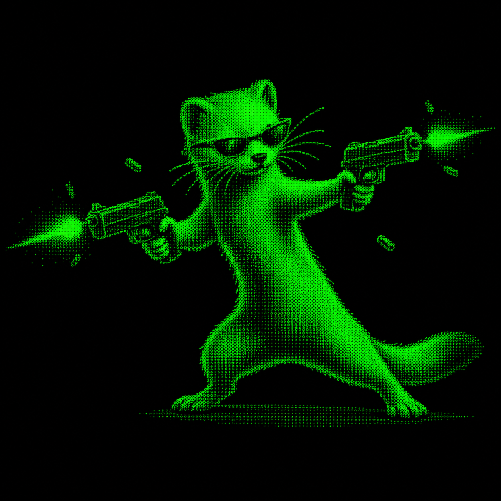

# Matrix Speedrunner

<p align="center">
  
</p>

> *Follow the white ermine.*

Mini-jeu de salon en ligne de commande, thème **Matrix** (avec une touche
bretonne). Format de runs courts et compétitifs, pensé pour un stand.

---

## Installation

### Linux / macOS — depuis les sources

Pré-requis : [Rust stable](https://rustup.rs/).

```bash
git clone https://github.com/dminier/matrix_speedrunner.git
cd matrix_speedrunner
cargo build --release
```

L'exécutable est généré dans `target/release/matrix_speedrunner`.
Copie-le dans le dossier de ton choix puis lance-le :

```bash
./matrix_speedrunner
```

### Windows — depuis les sources

Installe Rust via <https://rustup.rs/>, puis dans PowerShell :

```powershell
git clone https://github.com/dminier/matrix_speedrunner.git
cd matrix_speedrunner
cargo build --release
.\target\release\matrix_speedrunner.exe
```

---

## Feuille de score

À chaque fin de partie, le score est ajouté à un fichier **`score.xlsx`**
créé automatiquement **dans le même dossier que l'exécutable**.

Le fichier est un classeur Office Excel standard, ouvrable directement avec
Excel, LibreOffice Calc, Google Sheets, ou n'importe quel outil compatible.

**Colonnes :**

| Colonne          | Description                                |
|------------------|--------------------------------------------|
| `timestamp`      | Date et heure du run (RFC 3339)            |
| `name`           | Pseudo du joueur                           |
| `contact`        | Email ou téléphone                         |
| `mode`           | Mode de jeu (Speed Runner / Hack Time…)    |
| `difficulty`     | Easy / Normal / Insane                     |
| `score`          | Score total                                |
| `wpm`            | Mots par minute (5 caractères = 1 mot)     |
| `max_combo`      | Plus long enchaînement sans erreur         |
| `items_done`     | Nombre de commandes validées               |
| `duration_secs`  | Durée du run en secondes                   |

Le fichier est régénéré entièrement à chaque enregistrement (écriture
atomique) — pas de risque de corruption en cas d'arrêt brutal.

Pour récupérer la feuille de score à la fin du concours, il suffit de
copier `score.xlsx` depuis le dossier de l'exécutable.

---

## Licence

WTFPL — voir [LICENSE](LICENSE).
